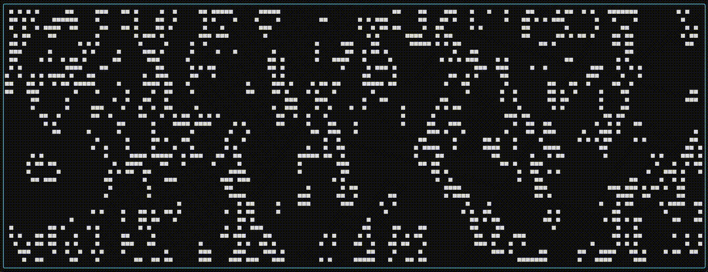

# 🧬 _(Yet Another)_ Conway’s Game of Life

A lightweight [TUI](https://en.wikipedia.org/wiki/Text-based_user_interface)
version of
[Conway's Game of Life](https://en.wikipedia.org/wiki/Conway%27s_Game_of_Life),
written to learn [Zig](https://ziglang.org/).

<p align="center">
  
</p>

## 🧩 What is Conway’s Game of Life?

Conway’s Game of Life is a cellular automaton devised by mathematician John
Conway in 1970. It’s not a traditional game, there are no players, but a
simulation that evolves over time based on simple rules.

Each cell on the grid is either alive or dead. At every tick _(generation)_, all
cells update simultaneously based on their neighbors:

- A dead cell with exactly 3 neighbors becomes alive (birth).
- A live cell with 2 or 3 neighbors survives.
- All other live cells die _(loneliness or overcrowding)_.

Despite its simplicity, the system exhibits complex, emergent behavior,
patterns that move, replicate, and even compute.

## ⚙️ Requirements

- [Zig 0.15.1](https://ziglang.org/download/0.15.1/release-notes.html)

## 🚀 Run / Test / Format

```bash
# build
zig build run
# test
zig build test
# format
zig fmt .
```

## 🎮 Interactive Commands

| Key |               Action |
| :-- | -------------------: |
| `g` |  spawn random glider |
| `c` |      clear the board |
| `r` | reset to random seed |
| `q` |                 quit |

> [!TIP]
> mash `g`, then sit back and enjoy the entropy.
